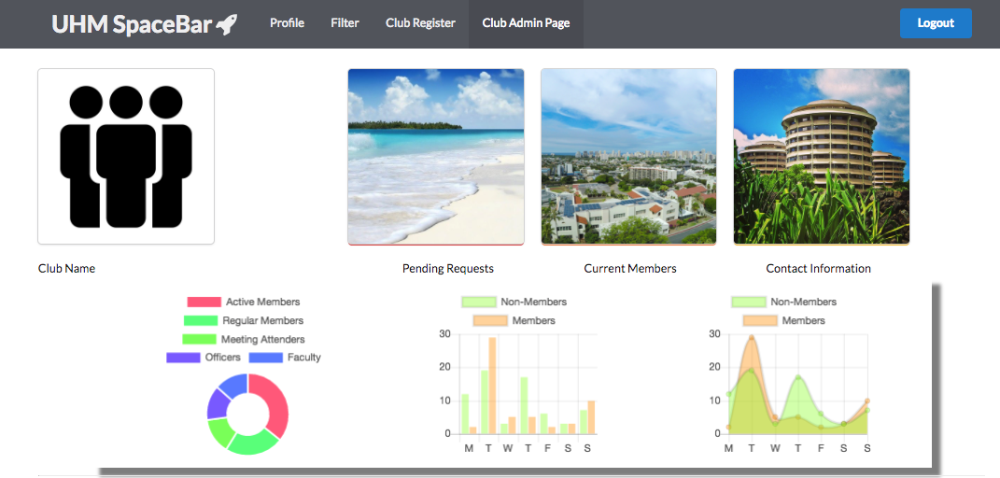

# Table of contents

* [About UHM SpaceBar](#about-uhmspacebar)
* [Installation](#installation)
* [Milestones](#milestones)

# About UHMSpaceBar

[UHM Spacebar](http://uhmspacebar.meteorapp.com) is how University of Hawaii at Manoa students can get connected with any RIO/non-RIO club on campus. When accessing the meteor application, the following landing page appears:

[Landing Page](http://uhmspacebar.meteorapp.com)


We will be providing UHM members the ability to login through CAS login. After authenticating the UH login the user is then prompted to make a user profile

[Profile Page](http://uhmspacebar.meteorapp.com/nn4/profile)


This is what a standard user profile will look like after creating. They will be able to have a feed of upcoming events for clubs that they add to their watchlist and can filter the upcoming events based on club. It will also show a description of the events. They are also able to edit any of their information here.

[Filter Page](http://uhmspacebar.meteorapp.com/nn4/filter)


We will also provide users to find new clubs that they are interested in. We will show various club options on the left side of the screen and allow users to filter based on personal preferences. Each club will have a json value associated with their name (string comparison), club type, club size, and major affiliation (macro values).

[Club Register](http://uhmspacebar.meteorapp.com/nn4/Club_Register)


For new or existing clubs that would like to sign up on UHMSpaceBar, they can access the Register New Club page. This will prompt them with a form to fill out. This will add new clubs to the database. There are a few fields in the register period in attempt to reduce friction of onboarding. Users can/will be prompted to add more personalization while using the web application.

[Club Admin Page](http://uhmspacebar.meteorapp.com/nn4/Club_Admin)


After you register you are able to access your club admin page. This will show you infographs of how your club is faring based on some information you input.


# Installation

First, [install Meteor](https://www.meteor.com/install).

Second, [download a copy of UHMSpacebar](https://github.com/uhmspacebar/uhmspacebar), or clone it using git.
  
Third, cd into the app/ directory and install libraries with:

```
$ meteor npm install
```

Fourth, run the system with:

```
$ meteor npm run start
```

If all goes well, the application will appear at [http://localhost:3000](http://localhost:3000). If you have an account on the UH test CAS server, you can login.


## Directory structure

The top-level directory structure contains:

```
app/        # holds the Meteor application sources
config/     # holds configuration files, such as settings.development.json
.gitignore  # don't commit IntelliJ project files, node_modules, and settings.production.json
```

This structure separates configuration files (such as the settings files) in the config/ directory from the actual Meteor application in the app/ directory.

The app/ directory has this top-level structure:

```
client/
  lib/           # holds Semantic UI files.
  head.html      # the <head>
  main.js        # import all the client-side html and js files. 

imports/
  api/           # Define collection processing code (client + server side)
    base/
    interest/
    profile/
  startup/       # Define code to run when system starts up (client-only, server-only)
    client/        
    server/        
  ui/
    components/  # templates that appear inside a page template.
    layouts/     # Layouts contain common elements to all pages (i.e. menubar and footer)
    pages/       # Pages are navigated to by FlowRouter routes.
    stylesheets/ # CSS customizations, if any.

node_modules/    # managed by Meteor

private/
  database/      # holds the JSON file used to initialize the database on startup.

public/          
  images/        # holds static images for landing page and predefined sample users.
  
server/
   main.js       # import all the server-side js files.
```


# Milestones
- [Milestone 1](https://github.com/uhmspacebar/uhmspacebar/projects/1)

- [Milestone 2](https://github.com/uhmspacebar/uhmspacebar/projects/2)
