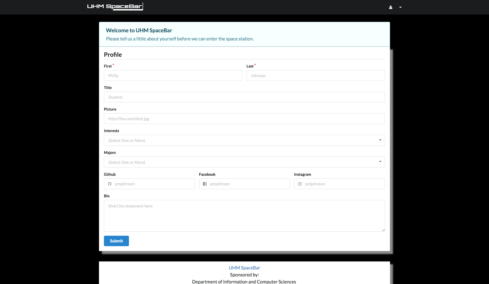
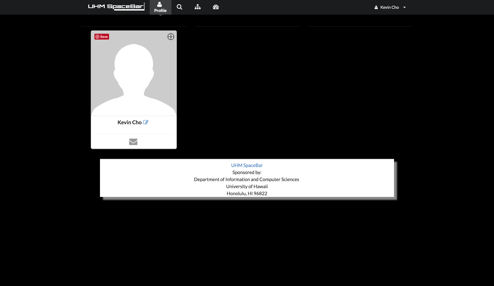
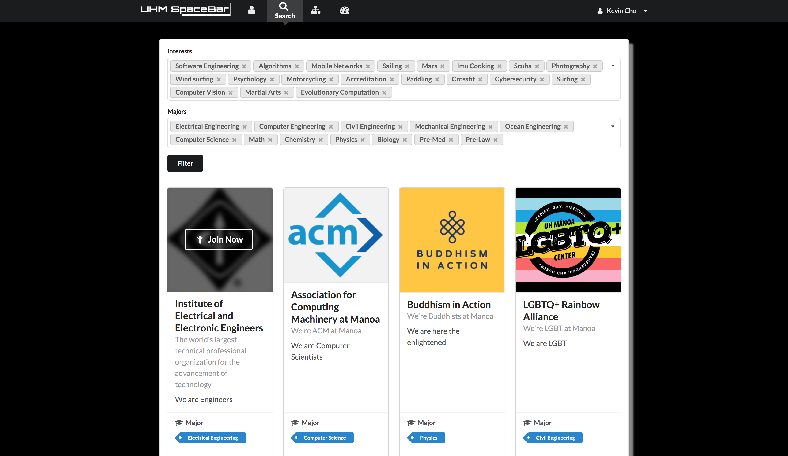
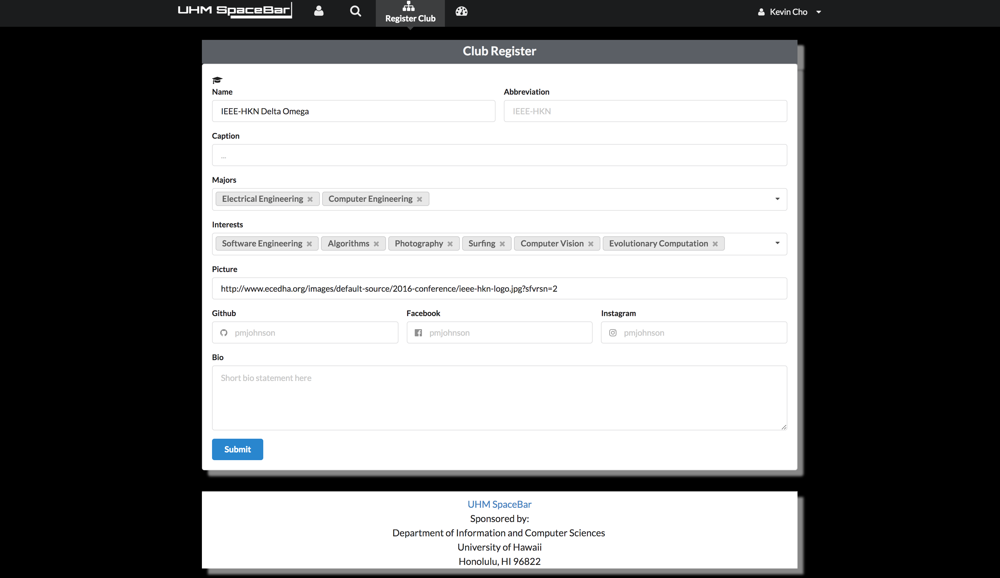
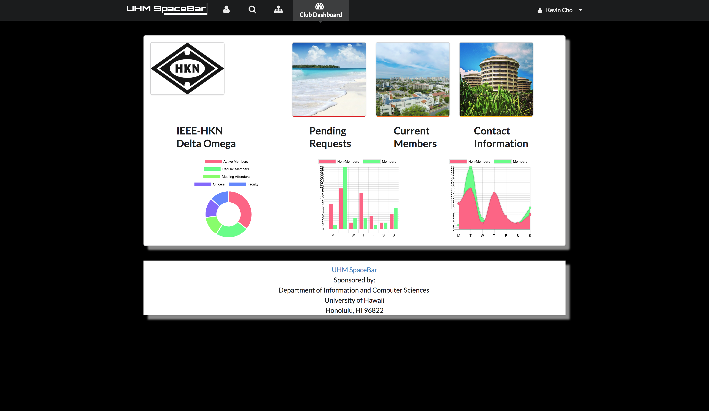
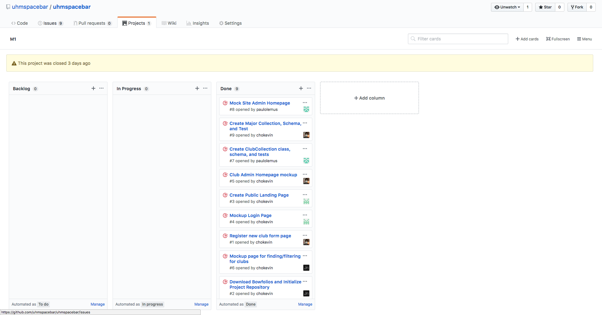

# Table of contents

- [About UHM SpaceBar](#about-uhmspacebar) 
  - [Functionality](#functionality)
- [How to Use UHM Spacebar](#how-to-use-uhm-spacebar)
- [Installation](#installation)
  - [Directory Structure](#directory-structure)
  - [Import Conventions](#import-conventions)
  - [Naming Conventions](#naming-conventions)
  - [Data Models](#data-models)
  - [CSS](#css)
  - [Routing](#routing)
  - [Authentication](#authentication)
  - [Configuration](#configuration)
  - [Quality Assurance](#quality-assurance)
    - [ESLint](#eslint)
    - [Data Models Unit Tests](#data-models-unit-tests)
- [Milestones](#milestones)
  - [Mock Ups](#mock-ups)
  - [Milestone 1](#milestone-1)
  - [Milestone 2](#milestone-2)
- [Known Bugs and Issues](#known-bugs-and-issues)
- [Future Features](#future-features)
- [Special Thanks](#special-thanks)
- [Contact Us](#contact-us)


# About UHMSpaceBar

[UHM Spacebar](http://uhmspacebar.meteorapp.com) is how University of Hawaii at Manoa students can get connected with any RIO/non-RIO club on campus. When accessing the meteor application, the following landing page appears:

#Functionality

UHM Spacebar brings together clubs across campus to circulate information to the public. People who are interested in clubs and club owners can create profiles. Users are able to find clubs and filter based on major or interest. Clubs are able to see who is interested and advertise events that are coming u. This makes sure that people understand more ways of getting involved around campus. 
[Landing Page](http://uhmspacebar.meteorapp.com)

#How to use UHM SpaceBar


We will be providing UHM members the ability to login through CAS login. After authenticating the UH login the user is then prompted to make a user profile

[Profile Page](http://uhmspacebar.meteorapp.com/nn4/profile)


This is what a standard user profile will look like after creating. They will be able to have a feed of upcoming events for clubs that they add to their watchlist and can filter the upcoming events based on club. It will also show a description of the events. They are also able to edit any of their information here. 

This page is also an authentication factor for many of the other pages on the web application. Many aspects of the website depend on the creation of a user profile such as defining a profile image and major. These attributes are important in creating a custom user profile and providing information to club admins who would like to know more information about their pending members.

At all times a user can edit their information by going to the top right which shows the user's name. A drop down menu will appear which will allow a user to return back to the edit profile form.

[User Profile Page]()

This is what a standard user profile would look like. On the right there would be a list of clubs and events in feed format for a user to keep track of. This is similar to a Facebook feed. This functionality was not able to be completed.


[Filter Page](http://uhmspacebar.meteorapp.com/nn4/filter)


We will also provide users to find new clubs that they are interested in. We will show various club options on the left side of the screen and allow users to filter based on personal preferences. Each club will have a json value associated with their name (string comparison), club type, club size, and major affiliation (macro values). They also have the option of joining a club on this page. 

[Club Register](http://uhmspacebar.meteorapp.com/nn4/Club_Register)


For new or existing clubs that would like to sign up on UHMSpaceBar, they can access the Register New Club page. This will prompt them with a form to fill out. This will add new clubs to the database. There are a few fields in the register period in attempt to reduce friction of onboarding. Users can/will be prompted to add more personalization while using the web application.

[Club Admin Page](http://uhmspacebar.meteorapp.com/nn4/Club_Admin)


After you register you are able to access your club admin page. This will show you infographs of how your club is faring based on some information you input.

This would also show you where pending requests, current members, and a modal for contact information would appear. Unfortunately, we were unable to get to that part of the web application.


# Installation

First, [install Meteor](https://www.meteor.com/install).

Second, [download a copy of UHMSpacebar](https://github.com/uhmspacebar/uhmspacebar), or clone it using git.
  
Third, cd into the app/ directory and install libraries with:

```
$ meteor npm install
```

Fourth, run the system with:

```
$ meteor npm run start
```

If all goes well, the application will appear at [http://localhost:3000](http://localhost:3000). If you have an account on the UH test CAS server, you can login.


## Directory structure

The top-level directory structure contains:

```
app/        # holds the Meteor application sources
config/     # holds configuration files, such as settings.development.json
.gitignore  # don't commit IntelliJ project files, node_modules, and settings.production.json
```

This structure separates configuration files (such as the settings files) in the config/ directory from the actual Meteor application in the app/ directory.

The app/ directory has this top-level structure:

```
client/
  lib/           # holds Semantic UI files.
  head.html      # the <head>
  main.js        # import all the client-side html and js files. 

imports/
  api/           # Define collection processing code (client + server side)
    base/
    interest/
    profile/
  startup/       # Define code to run when system starts up (client-only, server-only)
    client/        
    server/        
  ui/
    components/  # templates that appear inside a page template.
    layouts/     # Layouts contain common elements to all pages (i.e. menubar and footer)
    pages/       # Pages are navigated to by FlowRouter routes.
    stylesheets/ # CSS customizations, if any.

node_modules/    # managed by Meteor

private/
  database/      # holds the JSON file used to initialize the database on startup.

public/          
  images/        # holds static images for landing page and predefined sample users.
  
server/
   main.js       # import all the server-side js files.
```

## Import conventions

This system adheres to the Meteor 1.4 guideline of putting all application code in the imports/ directory, and using client/main.js and server/main.js to import the code appropriate for the client and server in an appropriate order.

This system accomplishes client and server-side importing in a different manner than most Meteor sample applications. In this system, every imports/ subdirectory containing any Javascript or HTML files has a top-level index.js file that is responsible for importing all files in its associated directory.   

Then, client/main.js and server/main.js are responsible for importing all the directories containing code they need. For example, here is the contents of client/main.js:

```
import '/imports/startup/client';
import '/imports/ui/components/form-controls';
import '/imports/ui/components/directory';
import '/imports/ui/components/user';
import '/imports/ui/components/landing';
import '/imports/ui/layouts/directory';
import '/imports/ui/layouts/landing';
import '/imports/ui/layouts/shared';
import '/imports/ui/layouts/user';
import '/imports/ui/pages/directory';
import '/imports/ui/pages/filter';
import '/imports/ui/pages/landing';
import '/imports/ui/pages/user';
import '/imports/api/base';
import '/imports/api/profile';
import '/imports/api/interest';
import '/imports/ui/stylesheets/style.css';
```

Apart from the last line that imports style.css directly, the other lines all invoke the index.js file in the specified directory.

We use this approach to make it more simple to understand what code is loaded and in what order, and to simplify debugging when some code or templates do not appear to be loaded.  In our approach, there are only two places to look for top-level imports: the main.js files in client/ and server/, and the index.js files in import subdirectories. 

Note that this two-level import structure ensures that all code and templates are loaded, but does not ensure that the symbols needed in a given file are accessible.  So, for example, a symbol bound to a collection still needs to be imported into any file that references it. 
 
## Naming conventions

This system adopts the following naming conventions:

  * Files and directories are named in all lowercase, with words separated by hyphens. Example: accounts-config.js
  * "Global" Javascript variables (such as collections) are capitalized. Example: Profiles.
  * Other Javascript variables are camel-case. Example: collectionList.
  * Templates representing pages are capitalized, with words separated by underscores. Example: Directory_Page. The files for this template are lower case, with hyphens rather than underscore. Example: directory-page.html, directory-page.js.
  * Routes to pages are named the same as their corresponding page. Example: Directory_Page.


## Data model

The UHM SpaceBar data model is implemented by four Javascript classes: [ProfileCollection](https://github.com/bowfolios/bowfolios/blob/master/app/imports/api/profile/ProfileCollection.js), [InterestCollection](https://github.com/bowfolios/bowfolios/blob/master/app/imports/api/interest/InterestCollection.js), [MajorCollection](https://github.com/bowfolios/bowfolios/blob/master/app/imports/api/interest/InterestCollection.js), and [EventCollection](https://github.com/bowfolios/bowfolios/blob/master/app/imports/api/interest/InterestCollection.js). All of these classes encapsulate a MongoDB collection with the same name and export a single variable (Profiles, Interests, Majors, and Events )that provides access to that collection. 

Any part of the system that manipulates the UHM SpaceBar data model imports the various collection variable, and invokes methods of that class to get or set data.

There are many common operations on MongoDB collections. To simplify the implementation, all collections created for UHM SpaceBar inherit from the [BaseCollection](https://github.com/bowfolios/bowfolios/blob/master/app/imports/api/base/BaseCollection.js) class.

The [BaseUtilities](https://github.com/bowfolios/bowfolios/blob/master/app/imports/api/base/BaseUtilities.js) file contains functions that operate across both classes. 

Each collection created for this project have Mocha unit tests in [ProfileCollection.test.js](https://github.com/bowfolios/bowfolios/blob/master/app/imports/api/profile/ProfileCollection.test.js) and [InterestCollection.test.js](https://github.com/bowfolios/bowfolios/blob/master/app/imports/api/interest/InterestCollection.test.js). See the section below on testing for more details.

## CSS

The application uses the [Semantic UI](http://semantic-ui.com/) CSS framework. To learn more about the Semantic UI theme integration with Meteor, see [Semantic-UI-Meteor](https://github.com/Semantic-Org/Semantic-UI-Meteor).

The Semantic UI theme files are located in [app/client/lib/semantic-ui](https://github.com/ics-software-engineering/meteor-application-template/tree/master/app/client/lib/semantic-ui) directory. Because they are located in the client/ directory and not the imports/ directory, they do not need to be explicitly imported to be loaded. (Meteor automatically loads all files into the client that are located in the client/ directory). 

Note that the user pages contain a menu fixed to the top of the page, and thus the body element needs to have padding attached to it.  However, the landing page does not have a menu, and thus no padding should be attached to the body element on that page. To accomplish this, the [router](https://github.com/bowfolios/bowfolios/blob/master/app/imports/startup/client/router.js) uses "triggers" to add an remove the appropriate classes from the body element when a page is visited and then left by the user. 

## Routing

For display and navigation among its four pages, the application uses [Flow Router](https://github.com/kadirahq/flow-router).

Routing is defined in [imports/startup/client/router.js](https://github.com/ics-software-engineering/meteor-application-template/blob/master/app/imports/startup/client/router.js).

BowFolios defines the following routes:

  * The `/` route goes to the public landing page.
  * The `/directory` route goes to the public directory page.
  * The `/<user>/profile` route goes to the profile page associated with `<user>`, which is the UH account name.
  * The `/<user>/filter` route goes to the filter page associated with `<user>`, which is the UH account name.


## Authentication

For authentication, the application uses the University of Hawaii CAS test server, and follows the approach shown in [meteor-example-uh-cas](http://ics-software-engineering.github.io/meteor-example-uh-cas/).

When the application is run, the CAS configuration information must be present in a configuration file such as  [config/settings.development.json](https://github.com/ics-software-engineering/meteor-application-template/blob/master/config/settings.development.json). 

Anyone with a UH account can login and use BowFolio to create a portfolio.  A profile document is created for them if none already exists for that username.

## Authorization

When a user first logs in to the application the only page they are able to access is the profile creation page. This is because most of the application will be restricted to creating a specific user profile within the applcation. Information such as the user's major, profile image, and interests are important in creating a user profile rather than just a user name. 

After creating a user profile, a user has access to the filter page and the club creation page as outlined above. The club admin page requires another authorization as you need to create a club first. Create a club should also have another layer of authentication; however, we did not get to implementing an admin page.

All pages require authentication through CAS. Thankfully the originally Bowfolios that this application used as its base application had a working UHM CAS login that we could use to filter users to UH students.

To prevent people from accessing pages they are not authorized to visit, template-based authorization is used following the recommendations in [Implementing Auth Logic and Permissions](https://kadira.io/academy/meteor-routing-guide/content/implementing-auth-logic-and-permissions). 

The application implements template-based authorization using an If_Authorized template, defined in [If_Authorized.html](https://github.com/bowfolios/bowfolios/blob/master/app/imports/ui/layouts/user/if-authorized.html) and [If_Authorized.js](https://github.com/bowfolios/bowfolios/blob/master/app/imports/ui/layouts/user/if-authorized.js).

## Configuration

The [config](https://github.com/bowfolios/bowfolios/tree/master/config) directory is intended to hold settings files.  The repository contains one file: [config/settings.development.json](https://github.com/bowfolios/bowfolios/blob/master/config/settings.development.json).

The [.gitignore](https://github.com/bowfolios/bowfolios/blob/master/.gitignore) file prevents a file named settings.production.json from being committed to the repository. So, if you are deploying the application, you can put settings in a file named settings.production.json and it will not be committed.

UHM SpaceBar checks on startup to see if it has an empty database in [initialize-database.js](https://github.com/bowfolios/bowfolios/blob/master/app/imports/startup/server/initialize-database.js), and if so, loads the file specified in the configuration file, such as [settings.development.json](https://github.com/bowfolios/bowfolios/blob/master/config/settings.development.json).  For development purposes, a sample initialization for this database is in [initial-collection-data.json](https://github.com/bowfolios/bowfolios/blob/master/app/private/database/initial-collection-data.json).

## Quality Assurance

### ESLint

UHM Spacebar includes a [.eslintrc](https://github.com/bowfolios/bowfolios/blob/master/app/.eslintrc) file to define the coding style adhered to in this application. You can invoke ESLint from the command line as follows:

```
meteor npm run lint
```

ESLint should run without generating any errors.  

It's significantly easier to do development with ESLint integrated directly into your IDE (such as IntelliJ).

### Data model unit tests

To run the unit tests on the data model, invoke the script named 'test', which is defined in the package.json file:

```
meteor npm run test
```

This outputs the results to the console. Here is an example of a successful run, with timestamps removed:

```
[~/github/bowfolios/bowfolios/app]-> meteor npm run test

> bowfolios@ test /Users/philipjohnson/github/bowfolios/bowfolios/app
> TEST_WATCH=1 meteor test --driver-package meteortesting:mocha

[[[[[ Tests ]]]]]                             

=> Started proxy.                             
=> Started MongoDB.  
                         
(STDERR) Note: you are using a pure-JavaScript implementation of bcrypt.
(STDERR) While this implementation will work correctly, it is known to be
(STDERR) approximately three times slower than the native implementation.
(STDERR) In order to use the native implementation instead, run
(STDERR) 
(STDERR)   meteor npm install --save bcrypt
(STDERR) 
(STDERR) in the root directory of your application.

 --------------------------------
 ----- RUNNING SERVER TESTS -----
 --------------------------------
   
=> Started your app.

=> App running at: http://localhost:3000/
    InterestCollection
    ✓ #define, #isDefined, #removeIt, #dumpOne, #restoreOne (69ms)
    ✓ #findID, #findIDs  
    ProfileCollection
    ✓ #define, #isDefined, #removeIt, #dumpOne, #restoreOne (66ms)
    ✓ #define (illegal interest)
    ✓ #define (duplicate interests)

   5 passing (178ms)

Load the app in a browser to run client tests, or set the TEST_BROWSER_DRIVER environment variable. See https://github.com/DispatchMe/meteor-mocha/blob/master/README.md#run-app-tests
```


# Milestones
The following section will outline the work that was done for both milestones.

# Mock ups

# Milestone 1
- [Milestone 1](https://github.com/uhmspacebar/uhmspacebar/projects/1)

This is what we had turned in for milestone one. Milestone one had included creating basic design mock ups of what we wanted our website to look like. This did not include any backend wiring and it was just to show case what the potential final product would look like.

Our project page on Github looked like the following: 


We had 9 issues that were completed. The following are pictures of the pages that we had completed at the time.


[Profile Page](http://uhmspacebar.meteorapp.com/nn4/profile)


[Filter Page](http://uhmspacebar.meteorapp.com/nn4/filter)


[Club Register](http://uhmspacebar.meteorapp.com/nn4/Club_Register)


[Club Admin Page](http://uhmspacebar.meteorapp.com/nn4/Club_Admin)


# Milestone 2

- [Milestone 2](https://github.com/uhmspacebar/uhmspacebar/projects/2)

For Milestone 2 we were required to finish the web application to include functionality and improve the software design process. We had definitely stepped it up a notch by increasing the amount of issues completed by the second milestone. We increased our production from 9 issues to 17 issues. 


Hello.


#Known Bugs and Issues

Some known bugs that we have with our application reside in the club admin page. We were unable to get accessing member information due to the lack of time. We were also not able to display any club information or allow users to add new events which should be done on the club admin page. Most of the time was spent trying to wire the form and the page together which took away some of the key functionality of this page.

Also the profile page should have more information on it but again we were unable to get to that part of the project. There should be a feed that shows any upcoming events for clubs that a user is a part of. 

One bug that we ran into was the fact that Chart.js does not like to rerender when we leave a template. Currently we have Meteor render Chart.js through the Template onRendered function. However, when navigating away from the project and returning the template will not rerun the onRendered function and the DOM won't be manipulated. As a quick fix the user experience will auto-refresh the page. This is bad because it creates latency within the product, yet currently this is unavoidable.

#Future Features

If time is permitting, it would be nice to add the remaining functionality left for the profile page and the admin page.

#Community Feedback

The application was tried by the following five people: Jaimie Obatake, Kyle Chan, Jonathan Lau, Arnold Shek, and Akira Vernon. The following comments were made.

### Good Feedback


### Needs improvement

#Special Thanks

#Contact Us
Developers of UHM Spacebar: Kevin Cho, Jonathan Nguyen, Aaron Nonaka, Paulo Lemus

Email: chokevin@hawaii.edu / / /